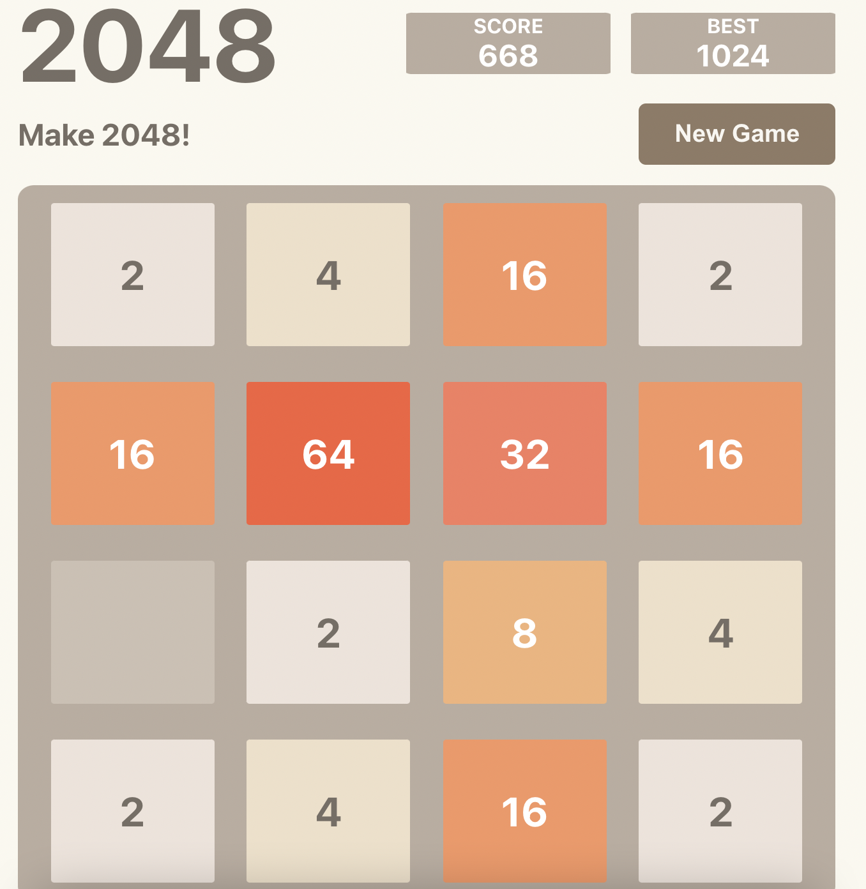

#2048
---
https://dobidugi.github.io/2048

### 게임룰
w, a, s, d 키 또는 방향키를 이용해 
같은 숫자끼리합치고 2048블럭을 만들면 승리하는게임 
(블럭이 움직이지 않을경우 한영키를 눌러 영문으로 변환) 
단 합칠수 있는는 블럭이 없을경우 플레이어의 패배

---
###사용 기술 
- react.js, Typescript
